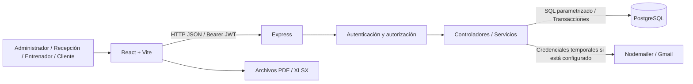
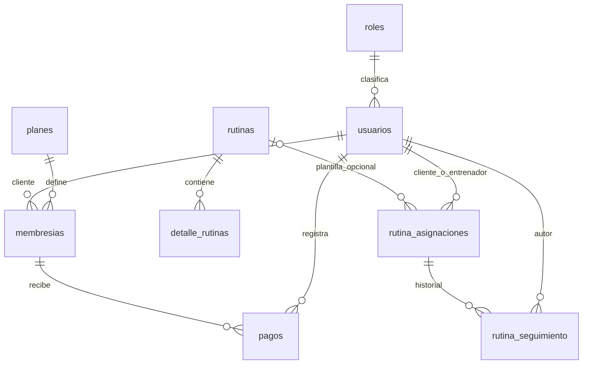

# Arquitectura y decisiones del sistema

Este documento describe el sistema actual y los cambios realizados para cerrar los hallazgos de la revisión del Entregable 2. El alcance funcional de referencia es el que el equipo proporcionó: seguridad, administración, membresías/pagos, rutinas, dashboard y reportes, con acceso por cuatro roles.

## Organización

| Carpeta | Responsabilidad |
|---|---|
| `frontend/src/views/` | Pantallas públicas y pantallas de administrador, recepción, entrenador y cliente. |
| `frontend/src/components/` | Componentes compartidos: navegación, pagos, editor de ejercicios, seguimiento y notificaciones. |
| `frontend/src/lib/` | Comunicación con API y utilidades de sesión/rutinas. |
| `backend/routes/` | Rutas HTTP y permisos de entrada. |
| `backend/controllers/` | Casos de uso: usuarios, planes, pagos, reportes y rutinas. |
| `backend/services/` | Reglas reutilizables de membresías, notificaciones y rutinas. |
| `backend/database/` | Esquema, migraciones incrementales y semillas. |
| `backend/scripts/` | Respaldo, diagnóstico de correo, preparación de demostración y prueba en navegador. |
| `backend/test/` | Pruebas del servidor, permisos, arranque y preparación de la demostración. |

## Flujo de una operación

1. El usuario inicia sesión. El servidor compara el hash bcrypt de la contraseña y devuelve un JWT.
2. El navegador envía el JWT con cada solicitud. Express comprueba firma y vencimiento, además del estado, rol y versión de sesión guardados en PostgreSQL.
3. La ruta comprueba el rol. El controlador valida los datos y realiza consultas parametrizadas; los casos con varias escrituras usan transacciones.
4. La API devuelve JSON. La pantalla actualiza sus datos y presenta el resultado en una notificación integrada.
5. Las funciones sobre rutinas y seguimiento comprueban también a quién pertenece la asignación. Tener un rol permitido no da acceso a datos de otro entrenador o cliente.

## Modelo de datos principal

El diagrama resume las relaciones principales. El esquema SQL es la referencia completa: conserva además relaciones históricas de `rutinas`, el catálogo `ejercicios`, `configuracion` y `schema_migrations`. En una asignación, los ejercicios se guardan como una copia JSONB, no como referencias obligatorias al catálogo independiente de ejercicios.

## Decisiones y razones

| Decisión | Razón y efecto |
|---|---|
| Separar frontend y API | Las vistas consumen operaciones explícitas; la autorización permanece en el servidor. |
| PostgreSQL con claves, restricciones y transacciones | Evita referencias inválidas y escrituras parciales en pagos/asignaciones. |
| Hash bcrypt y versión de sesión | No guardar contraseñas en texto; revocar sesiones al cambiar credenciales, rol o estado. Una edición del nombre no debe expulsar al usuario. |
| Pagos con clave de operación y bloqueo | Reintentar la misma operación no duplica el cobro; renovar por adelantado conserva días ya pagados. |
| Copia de detalles en cada asignación | Cambiar una plantilla no altera una rutina ya entregada al cliente. |
| Una asignación activa por cliente | Un índice único parcial protege esta regla, incluso ante solicitudes simultáneas. |
| Componentes compartidos con navegación por rol | Administrador y recepción pueden registrar pagos sin mezclar sus paneles ni duplicar la lógica del formulario. |
| Migraciones incrementales | Aplicar cambios con seguimiento y transacción, conservando los datos existentes. |
| Importar la aplicación no inicia el servidor | Las pruebas pueden usar puertos temporales y cerrar todos sus recursos; el arranque real prepara migraciones y sincronización. |
| Datos DEMO explícitos e idempotentes | Permiten demostrar entrenamiento sin reemplazar cuentas, rutinas ni pagos reales. |

## Problemas encontrados y cambios realizados

| Problema observado | Corrección | Cómo se verifica |
|---|---|---|
| Editar un usuario devolvía PostgreSQL `42P08` y HTTP 500 | Tipos coherentes en los parámetros SQL; conservación de la revocación de sesión | Guardar una edición válida, recargar y comprobar persistencia; probar cambios de rol/contraseña/estado. |
| Administrador autorizado por API, pero sin pantalla de pagos | Ruta `/admin/pagos` dentro del panel administrativo y formulario compartido | Registrar pago como administrador, comprobar historial y conservar las restricciones de rutas de recepción. |
| Importar `index.js` abría otro listener | Arranque explícito separado de la importación y cierre de recursos | Prueba de importación sin servidor y pruebas que terminan normalmente. |
| Cinco CHECK con validación histórica pendiente | Nueva migración de validación, sin reescribir la migración original | Consultar `pg_constraint.convalidated` y comprobar las cinco restricciones. |
| Base local sin asignaciones ni seguimiento de muestra | Preparador de cuentas y rutina DEMO | Ejecutarlo dos veces y comprobar que no duplica ni sobrescribe datos ajenos. |

Estos cambios se comparan con el código auditado, no con una arquitectura original que no se ha adjuntado. La pila React/Vite, Express y PostgreSQL se conserva. Si la propuesta académica aprobada indicaba otra tecnología, el equipo deberá añadir esa comparación y su justificación; no se inventa aquí.

## Límites declarados

- No incluye aplicación móvil nativa, hardware externo, pasarela de pagos ni integración con Hacienda.
- Un recibo interno de pago no es una factura fiscal electrónica.
- El cliente ve sus últimos cinco pagos; no se ha prometido historial ilimitado o paginación.
- El respaldo disponible es manual; no se presenta como un servicio programado.
- Las pruebas de correo simulan éxito y fallo. La entrega real depende de la configuración de Gmail.
- Para despliegue público siguen siendo necesarias la configuración del entorno, HTTPS y la publicación del frontend. La demostración local no certifica un despliegue público.
