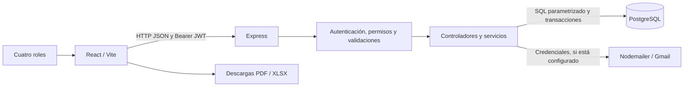

# Revisión del Entregable 2 y del alcance original

Fecha: 26 de septiembre de 2026. Referencia Git al cierre de la inspección: `2e989e4`.

Fuentes: **Entregable 2 - Entrega de Propuesta de SISTEMA.pdf** (cuatro páginas), alcance funcional proporcionado por el usuario durante esta revisión, código, consultas de solo lectura y pruebas en bases temporales.

## Dictamen

**El sistema cubre gran parte del alcance y tiene flujos integrados demostrables, pero no cumple todo todavía.** Se comprobaron dos brechas funcionales del alcance: la edición administrativa de usuarios falla con HTTP 500 y el administrador no tiene acceso visual a la gestión de pagos, aunque su API sí lo permite.

La base técnica permite preparar una demostración sólida. Para entregar con respaldo faltan cerrar esas brechas, completar la matriz de avance acordada por el equipo, preparar datos deportivos y ensayar la explicación de todos los integrantes.

El PDF es una guía y rúbrica del **avance del sistema**, no una especificación del gimnasio. Sus filas RF-01 a RF-04 son un ejemplo de matriz. El alcance concreto se tomó de la respuesta del usuario, no de ese ejemplo.

La auditoría no corrigió el código del producto ni modificó los datos del gimnasio. Se agregó este informe. Las herramientas y pruebas auxiliares quedaron en `.reports/pdf-audit/`, excluido de Git y separado de las dependencias del producto.

## 1. Alcance recibido y exclusiones

Se comprometieron autenticación por roles y contraseñas protegidas; CRUD de clientes y usuarios; control de membresías; registro/cobro de mensualidades; estados y vencimiento automático; creación, asignación y seguimiento de rutinas con ejercicios, series, repeticiones, peso y descanso; dashboard financiero y de clientes; reportes PDF/Excel.

El administrador debe controlar usuarios, planes, pagos, reportes y dashboard. Recepción gestiona clientes, cobra y verifica membresías; el entrenador crea, asigna y sigue rutinas. Para el cliente es opcional consultar pagos, vencimiento y rutina.

**Exclusiones confirmadas:** aplicación móvil nativa, hardware externo, pasarela de pagos en línea e integración con Hacienda. No se consideran faltantes. Tampoco se inventaron obligaciones de asistencia física, respaldo programado o una pantalla independiente de ejercicios.

## 2. Matriz funcional provisional

Los IDs `REV-*` organizan esta auditoría; el equipo debe sustituirlos por los IDs originales si existen. Se normalizó la lista recibida en 14 criterios obligatorios, con los permisos de cada rol incluidos en la función correspondiente. Notificaciones y correo no se añadieron al denominador porque no aparecen como requisitos obligatorios en la lista recibida.

“Verificado” significa que existe código integrado, persistencia cuando corresponde y un escenario de prueba aprobado. No significa ausencia de todo defecto posible. El 100 % se refiere al criterio concreto descrito en esta tabla, no al producto completo. No se asigna un porcentaje artificial a las dos filas parciales.

| ID | Requisito y rol | Estado | % avance del criterio | Evidencia |
|---|---|---|---|---|
| REV-01 | Inicio de sesión, contraseñas protegidas y permisos por rol | Verificado | 100 % | `authController.js`, `authMiddleware.js`; autenticación, bcrypt, revocación, límites por rol y propietario. |
| REV-02 | CRUD administrativo de usuarios | **Parcial: editar falla** | No cerrado | Alta, consulta y eliminación aprobadas en prueba adicional; `PUT /api/admin/usuarios/:id` devuelve 500. |
| REV-03 | CRUD de clientes por recepción | Verificado | 100 % | Navegador: crear, consultar, editar, cancelar eliminación y eliminar; `recepcionController.js`. |
| REV-04 | Gestión de planes por administrador | Verificado | 100 % | Prueba adicional CRUD completo por API, controles de UI y validaciones; `adminController.js`, `Planes.jsx`. |
| REV-05 | Consulta y verificación del estado de membresías por recepción | Verificado | 100 % | Consultas de clientes/membresías y pantallas de recepción; pruebas de morosidad y navegación. |
| REV-06 | Registro/cobro de mensualidades por recepción | Verificado | 100 % | Pagos guardados, validación de importe, renovación, transacción, concurrencia y reintentos. Es registro de cobro; pasarela excluida. |
| REV-07 | Estados activo/inactivo/moroso y actualización de vencimiento | Verificado con límite operativo documentado | 100 % | Renovación calcula fechas; sincronización detecta vencimiento y respeta suspensión. En el arranque actual se sincroniza al atender solicitudes, no mediante temporizador independiente. |
| REV-08 | Creación de rutinas digitales por entrenador | Verificado | 100 % | CRUD de plantillas y catálogo del entrenador; pruebas API y navegación. |
| REV-09 | Asignación personalizada de rutinas | Verificado | 100 % | Asignación a cliente, copia independiente de plantilla y archivo de la rutina anterior. |
| REV-10 | Seguimiento de rutinas por cliente y entrenador | Verificado | 100 % | Registro del cliente y consulta autorizada del entrenador; navegador e integración. |
| REV-11 | Ejercicios, series, repeticiones, peso y descanso por rutina | Verificado | 100 % | `ExerciseEditor.jsx`, normalización de detalles y persistencia JSONB; pruebas de asignación. |
| REV-12 | Dashboard administrativo: ingresos, activos y morosos | Verificado | 100 % | API y pantalla; prueba adicional contrasta los tres indicadores con consultas PostgreSQL. |
| REV-13 | Reportes exportables PDF y Excel para administrador | Verificado | 100 % | Descargas reales con formato y firma comprobados en navegador; consultas de ingresos/morosos/altas. |
| REV-14 | Control de pagos desde el panel del administrador | **Parcial: API disponible, interfaz bloqueada** | No cerrado | API GET/POST aprobada con token admin; única pantalla `/recepcion/pagos` restringida a Recepcionista. |

**Referencia conservadora de cobertura:** 12 de estos 14 criterios están completos: `12 / 14 × 100 = 85,7 %`, contando los parciales como cero criterios terminados. Es un recuento de funcionalidades con peso uniforme, no una calificación ni un porcentaje oficial del proyecto. Cambiar la agrupación o los pesos cambia ese resultado. El equipo/docente debe aceptar la descomposición y completar los porcentajes parciales antes de usarla como matriz oficial. El cálculo respalda un avance por encima del 75 % bajo esta metodología, **no el cumplimiento total del entregable**.

Función opcional del cliente: consulta de membresía, vencimiento y rutina implementada y demostrada. El historial devuelve los últimos cinco pagos sin paginación; no es un historial completo ilimitado. Esa limitación no se contó como incumplimiento obligatorio.

## 3. Hallazgos reproducibles

### H-01. La edición administrativa de usuarios devuelve HTTP 500 — prioridad alta

- Archivo: [adminController.js](../backend/controllers/adminController.js), consulta `UPDATE usuarios` aproximadamente en la línea 325.
- Reproducción: crear un usuario temporal válido como administrador y enviar `PUT /api/admin/usuarios/{id}` con `{"nombre":"Editado"}`.
- Resultado esperado: HTTP 200 y nombre actualizado.
- Resultado observado: HTTP 500. PostgreSQL devuelve `42P08`: tipos inconsistentes para el parámetro `$5`, `text` frente a `character varying`.
- El parámetro se utiliza tanto para asignar `password_hash` como dentro de `IS DISTINCT FROM` al decidir la revocación de sesión. Revisar los tipos explícitos de los parámetros de esa sentencia y agregar una prueba de actualización válida.
- Crear, consultar y eliminar el mismo usuario sí funcionó. No corresponde marcar todo el CRUD como finalizado.

### H-02. El administrador no puede gestionar pagos desde su interfaz — prioridad alta

- [App.jsx](../frontend/src/App.jsx), líneas 47–49: `/recepcion/pagos` está bajo `roles={['Recepcionista']}`.
- [ProtectedRoute.jsx](../frontend/src/components/ProtectedRoute.jsx): redirige al administrador a su dashboard al intentar otra área.
- No hay una ruta equivalente `/admin/pagos` ni acceso en el menú administrativo.
- [recepcionRoutes.js](../backend/routes/recepcionRoutes.js): el backend sí acepta Administrador y Recepcionista; la prueba adicional confirmó registrar y consultar pagos con token de administrador.
- La separación visual aplicada anteriormente evita mezclar pantallas de roles, pero deja incompleto el control de pagos del administrador comprometido en la propuesta.
- Solución a planificar: una gestión de pagos dentro del diseño administrativo, manteniendo la separación visual de recepción; o una modificación formal del alcance aceptada por el equipo/docente. No se cambió esa decisión en esta auditoría.

### H-03. Cinco restricciones no tienen validación histórica — prioridad media

[003_data_checks.sql](../backend/database/migrations/003_data_checks.sql) crea `planes_precio_positivo`, `planes_duracion_positiva`, `pagos_monto_positivo`, `membresias_fechas_validas` y `usuarios_estado_valido` con `NOT VALID`.

Se confirmó `convalidated=false` en la base local. Protegen escrituras nuevas, pero no certifican datos anteriores. Las consultas de control realizadas encontraron **cero filas que incumplan esas cinco condiciones**. Conviene preparar una migración con validación de restricciones después de revisar los datos. Este resultado no certifica todas las reglas de negocio de la base.

### H-04. Arranque del servidor con efectos al importarlo — observación técnica

La versión final inspeccionada de [index.js](../backend/index.js) llama a `app.listen(PORT)` sin comprobar `require.main === module`. Importarlo desde una prueba abre un servidor adicional. En la primera prueba suplementaria quedó un listener abierto y el proceso no finalizó solo; se detuvo esa ejecución. La segunda prueba controló todos los listeners y los cerró, sin cambiar el producto.

Esa versión tampoco aplica migraciones ni instala el temporizador de sincronización al iniciar; el middleware sincroniza membresías cuando recibe solicitudes, como máximo una vez por minuto. El README aún describe arranque con migraciones y temporizador, por lo que hay una discrepancia documental. Mantener un arranque separado de la exportación de la aplicación y documentar correctamente la preparación de la base ayudaría a reproducir la demostración y las pruebas.

## 4. Qué exige la rúbrica además del código

| Exigencia del PDF | Página | Evaluación |
|---|---|---|
| Aproximadamente 75 % de las funciones comprometidas, integradas y verificables | 1 y 4 | Evidencia favorable bajo el recuento de la sección 2; quedan dos funciones parciales y falta acordar la matriz oficial. |
| Sistema funcionando y demostración en vivo | 1 | Flujos demostrados automáticamente; la exposición ante el docente debe realizarla el equipo. Capturas/videos no la reemplazan. |
| Matriz ID, requisito, estado, porcentaje y evidencia | 2 | Este informe ofrece una base. Faltan IDs originales si los tienen, acuerdo de ponderación y porcentajes sustentados para parciales. |
| Base de datos con estructura, relaciones, restricciones, integridad, consultas y datos | 2 | Implementada y consultada; observación H-03 y datos deportivos por preparar. |
| Coherencia con el diseño presentado | 2 | Se dispone del alcance textual, pero no del modelo de datos original para comparar. |
| Organización, componentes, comunicación y decisiones técnicas | 2 | Explicables a partir del código; resumen en la sección 6. El equipo debe dominarlo. |
| Cambios tecnológicos respecto a la propuesta, justificados | 2 | Falta el documento técnico original y la justificación del equipo. |
| Problemas, soluciones, pendientes y estrategia de finalización | 3 | Este informe aporta problemas constatados y acciones; el equipo debe añadir su historia real, responsables y fechas. |
| Dominio técnico de todos los integrantes | 4 | No verificable con código; requiere ensayo de todos. |

La rúbrica asigna 3 puntos al avance, 2 al funcionamiento/integración, 2 a la base y 3 a demostración/dominio técnico. No se predice una nota.

## 5. Evidencia de ejecución y de datos

| Verificación | Resultado observado |
|---|---|
| `npm.cmd test` | Ejecución inicial: 14 pruebas aprobadas, 0 fallos. No cubren una edición administrativa válida como la de H-01. |
| `npm.cmd --prefix frontend run lint` | Sin errores ni advertencias. |
| `npm.cmd run build` | Compilación aprobada. |
| `npm.cmd --prefix backend run test:browser` | Ejecución inicial aprobada, salida 0. |
| `node .reports/pdf-audit/verify-scope.cjs` | **Fallo adicional confirmado en editar usuario**; CRUD de planes, resto del CRUD de usuario, pagos por API de admin e indicadores del dashboard aprobados. Salida 1 por el hallazgo. |
| Inspección de base local | Solo lectura; 12 tablas y restricciones inspeccionadas. |

Las ejecuciones iniciales y el sondeo adicional deben distinguirse: que la suite existente pase no demuestra cobertura completa del alcance. Además, el arranque observado al cierre tiene el efecto descrito en H-04; no se garantiza que repetir los comandos estándar finalice correctamente mientras conserve ese listener adicional.

Las pruebas funcionales crearon bases temporales y las eliminaron. No enviaron correos reales. Las pruebas de correo utilizan simulaciones, por lo que no certifican entrega en Gmail.

| Entidad | Registros en la base local inspeccionada |
|---|---:|
| Usuarios | 24 |
| Planes | 5 |
| Membresías | 20 |
| Pagos | 20 |
| Plantillas de rutinas | 9 |
| Ejercicios | 20 |
| Asignaciones | 0 |
| Seguimientos | 0 |

Hay 1 administrador, 3 recepcionistas, 4 entrenadores y 16 clientes. Preparar al menos una asignación y un seguimiento en una base de demostración, o crearlos explícitamente durante la exposición. Las tablas vacías no significan que falte la función: el flujo completo pasó en las pruebas temporales.

Pruebas del repositorio: [integración](../backend/test/workflows.test.js), [correo](../backend/test/email.test.js), [navegador](../backend/scripts/browser-check.js). Esquema: [schema.sql](../backend/database/schema.sql) y [migración de flujos](../backend/database/migrations/001_complete_workflows.sql). Evidencias locales auxiliares: `.reports/pdf-audit/` y capturas en `.reports/`; no se incluyen automáticamente al compartir Git.

## 6. Resumen para explicar la arquitectura

- `frontend/src/views/`: pantallas por rol; `components/`: navegación, formularios y notificaciones compartidos.
- `backend/routes/`: endpoints; `controllers/`: casos de uso; `services/`: reglas; `database/`: esquema y migraciones.
- El backend verifica JWT y estado/rol/versión de sesión en PostgreSQL; esconder menús no reemplaza esa autorización.
- Los pagos usan transacciones, bloqueo del cliente y una clave única de operación para evitar renovaciones simultáneas inconsistentes y cobros duplicados.
- Cada asignación conserva una copia JSONB de los detalles; cambiar una plantilla no cambia la rutina previamente entregada al cliente.
- Un índice único parcial limita a una asignación activa por cliente.
- Las notificaciones derivan de datos reales y se filtran por rol y propietario.

El diagrama explica el diseño actual. El PDF no obliga expresamente a una notación de diagrama; sí exige que el equipo explique organización y decisiones. Comparar este diseño con el original sigue pendiente.

## 7. Orden sugerido para cerrar la entrega

1. Corregir y probar la edición de usuarios; agregar el caso válido a las pruebas de integración.
2. Resolver el acceso administrativo a pagos dentro de su propio panel o formalizar el cambio de alcance.
3. Separar el arranque del servidor de su importación, reconciliar README/arranque y volver a ejecutar las pruebas.
4. Validar las cinco restricciones históricas mediante una migración controlada.
5. Adoptar la matriz de requisitos con IDs y criterios acordados; completar la comparación con el diseño original.
6. Preparar datos deportivos y ensayar con los cuatro roles. Cada integrante debe ejecutar y explicar una parte.
7. Añadir al entregable los problemas reales, soluciones, pendientes, responsables y fechas del equipo.

Guion mínimo: administrador muestra usuarios/planes/dashboard; recepción registra cliente y mensualidad; entrenador asigna rutina; cliente consulta vencimiento y registra seguimiento; entrenador consulta ese avance; administrador exporta un reporte. Mostrar también datos persistidos y los permisos entre roles. El flujo de pagos como administrador debe añadirse después de resolver H-02.
